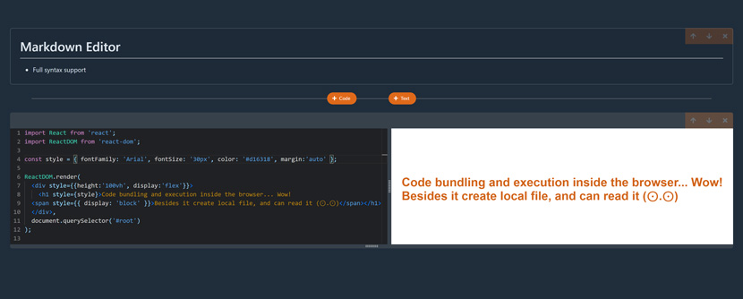

# Code notebook

**Code-notebook** is a development environment for writing and documenting JavaScript code inside the browser.
Markdown editor for creating documentation sections and code editor for writing and executing JavaScript code

---



---

## Features

- [ESBuild](https://esbuild.github.io/) to transpile and bundle all the code directly in the browser
- Custom plugins for ESBuild (to get packages from unpkg.com and correctly bundle them inside the browser: one plugin changes the paths to the npm packages and another set the appropriate content)
- Monaco Text Editor ([@monaco-editor/react](https://www.npmjs.com/package/@monaco-editor/react))
- [Prettier](https://www.npmjs.com/package/prettier) to format the user's code
- [Markdown Editor](https://www.npmjs.com/package/@uiw/react-md-editor) to handle text snippets
- [bulmaswatch/superhero](https://jenil.github.io/bulmaswatch/superhero/) theme for styling
- State Managament: [Redux](https://github.com/reduxjs/react-redux), [Immer](https://github.com/immerjs/immer#readme), [Thunk](https://github.com/reduxjs/redux-thunk)
- [Lerna](https://github.com/lerna/lerna) to handle all packages

## Getting started

1. Install dependencies

   ```bash
   npm install
   npx lerna bootstrap
   ```

2. Run app

   ```bash
   npm run start
   ```

3. Open [localhost:4005](http://localhost:4005/)

---

_The project is under development._
